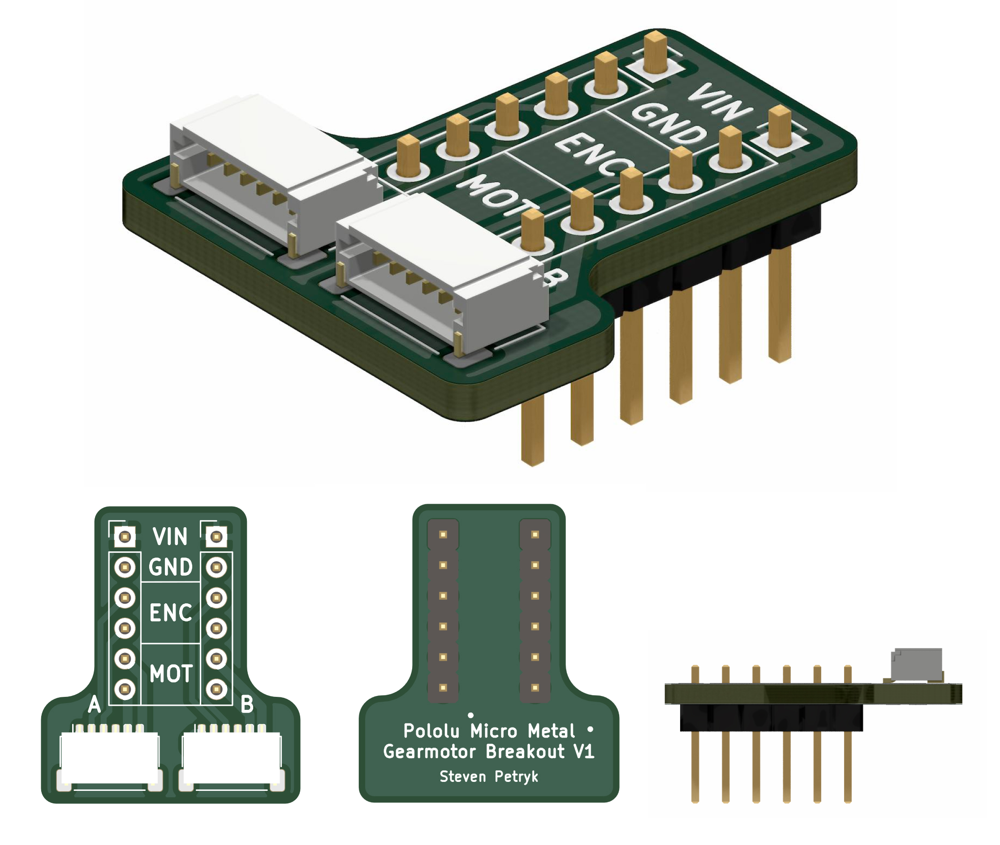
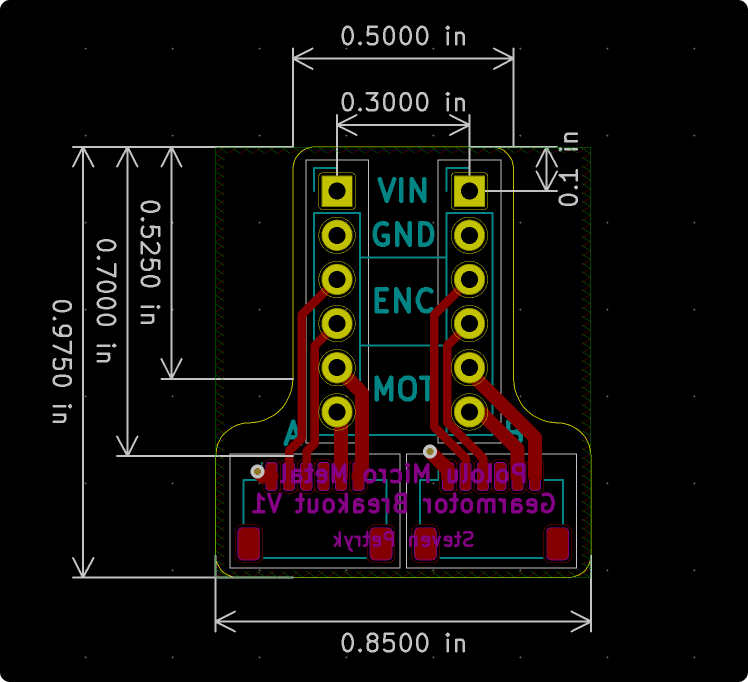

# Pololu micro metal gearmotor connector breakout board

This is a breadboard-friendly breakout board specifically designed to work with the Pololu micro metal gearmotor encoders/connectors, specifically these two:

- [Magnetic Encoder Pair Kit with Side-Entry Connector for Micro Metal Gearmotors](https://www.pololu.com/product/4761)
- [Magnetic Encoder Pair Kit with Top-Entry Connector for Micro Metal Gearmotors](https://www.pololu.com/product/4760)

These two encoders are fitted with JST-SH connectors with a specific pinout. JST-SH connectors are a bit too small to solder 20 AWG wires too, so this breakout board makes them easier to work with.

The two headers are spaced by 0.3", so it takes up minimal space on a standard breadboard, and you can let the JST connectors "hang off" the end of the breadboard to save even more space.

## Pinout

- **VIN**: 2.7V to 18V DC. Both pins are connected, so you can wire up power to whichever side is more convenient.
- **GND**: Ground. Just like VIN, these two pins are connected, so you only need to ground one side.
- **ENC**: These are the "OUT A" and "OUT B" from the Pololu encoder datasheet, two for each side. These are the outputs of the quadrature encoders for each motor.
- **MOT**: These are "M1" and "M2" from the Pololu encoder datasheet, two for each side. Hook these up to the motor supply voltages. If you're using a microcontroller, I've found the DRV8833 dual motor driver works well with Pololu's micro metal gearmotors.

## Purchasing

You can [order this board on JLCPCB →][jlcpcb]

It's quite small, and only two layers, so it should only cost $2-$4 USD. I have some extras, so if you want, I'd happily mail one to you (unassembled), just [DM me on Twitter][twitter].

[jlcpcb]: https://cart.jlcpcb.com/quote?uploadNum=81e9938b29a3497882d0e2311ea6c4a7&businessType=example&fileName=gerber
[twitter]: https://twitter.com/stevenpetryk

## Bill of materials

It's surprisingly hard to find horizontal JST SMD connectors from anywhere but Sparkfun, so I tend to just order parts from there to save on shipping. They have bulk discounts, so if you're doing lots of work with micro metal gearmotors, just buy a bunch.

- [Sparkfun JST SH Horizontal 6-Pin Connector](https://www.sparkfun.com/products/10210)
- [Sparkfun break away headers](https://www.sparkfun.com/products/116)

## Dimensions

  

